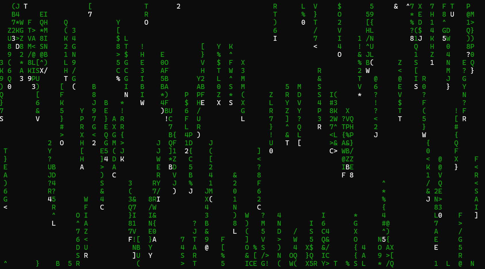

## Preview


# Matrix Rain (Java)

A Java implementation of the iconic Matrix digital rain effect.

## Prerequisites

- Java 17+ JDK installed

Verify installation:

```bash
java --version
javac --version
```

## Getting Started
### Create Folder in Your Machine
```bash
create folder MatrixRainProject
```
### Clone the Repository

```bash
git clone https://github.com/MukulSainii/Matrix-Rain.git
```

### Navigate to the Project Directory

```bash
cd MatrixRainProject
```

### Compile the Program

```bash
javac MatrixRain.java
```

### Run the Program

```bash
java MatrixRain
```

## Customization

You can modify the following settings by changing the constants in the source code:

- Rain speed
- Character density
- Color theme
### Rain Speed
Change the `DELAY` constant(smaller value = fast, larger value = slow).

### Character Density
Change the `WIDTH` constant. (Larger value = more rain columns, smaller value = fewer rain columns).

### Character Set
Modify the `chars` string in the `randomChar()` method to display different symbols.

### Color Theme (ANSI escape codes)
Modify the `HEAD_COLOR` and `TRAIL_COLOR` constants to change the appearance of the Matrix rain.
- Black: `\033[30m`
- Red: `\033[31m`
- Green: `\033[32m`
- Yellow: `\033[33m`
- Blue: `\033[34m`
- Magenta:`\033[35m`
- Cyan: `\033[36m`
- White: `\033[37m`
- Bright White:	`\033[97m`

## License

This project is open source and available under the MIT License.